# tonify-sims: three simulations of a direct music economy

Payout mechanisms, social-graph spread, and treasury survival for a direct
listener-to-artist music economy on Telegram/TON rails — deterministic,
red-teamed, byte-reproducible.

[](LICENSE)


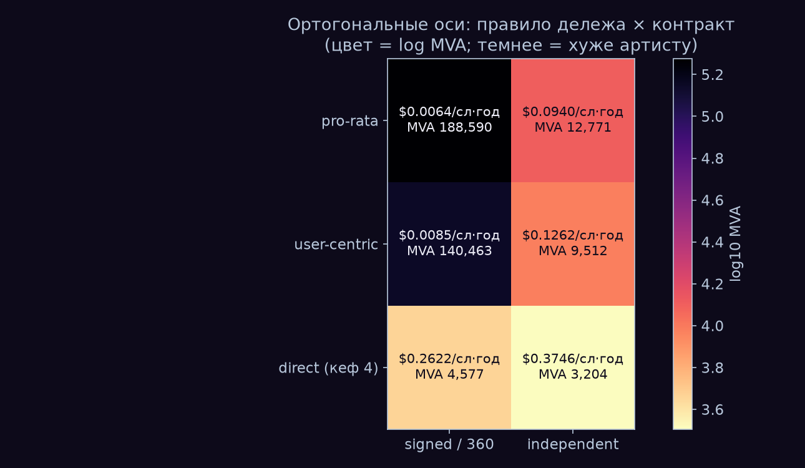

*MVA heatmap across the full {payout rule x contract} matrix.*

Your favourite artist needs 188,590 listeners to earn $100 a month under a
signed pro-rata streaming contract — or 3,204 directly-paying superfans at four
donations a year. This repository holds three deterministic simulations of a
direct music economy on Telegram/TON rails (Tonify): sim1 prices payout
mechanisms across a 200,000-artist synthetic market calibrated to three
independently measured anchors; sim2 models music spreading through a synthetic
Telegram-like social graph as complex contagion (a model, not Telegram data);
sim3 stress-tests the treasury law "payouts never exceed inflow" against
emission-funded token economies. The industry spent a decade debating the fair
formula. The formula moves artist viability ×1.34. The contract moves it ×14.7.
Precisely: in the full {rule × contract} matrix of minimum viable audience,
switching the division rule (pro-rata → user-centric) shifts an artist's MVA by
×1.34, while switching the contract (signed → independent) shifts it ×14.7
(fig7; PAPER, Addendum v0.5). Every claim below carries either a source or a
falsifier; a red team with the right to retract numbers reviewed each
simulation, and what it retracted is documented in this README.

## Key findings

Every row states its validity domain. Full numbers, sources and retractions:
[paper/](paper/), [sim2/README.md](sim2/README.md), [sim3/README.md](sim3/README.md).

| # | Finding | Figure | Source / falsifier |
|---|---------|--------|--------------------|
| 1 | **The contract outweighs the rule.** Across the full {rule × contract} MVA matrix, switching the division rule (pro-rata → user-centric) moves minimum viable audience ×1.34, switching the contract (signed → independent) moves it ×14.7 — the best World-A formula does not survive a 6.8% label pass-through: user-centric signed needs 140,095 listeners against 12,771 for pro-rata independent. The $100/month ladder: 188,590 (pro-rata signed) → 12,771 (pro-rata independent) → 3,204 (direct, at k=4 donations/superfan/yr); a signed-360 contract scales direct numbers ×0.70 (3,204 → 4,577). | [fig7](figures/fig7_matrix_heatmap.png), [fig5](figures/fig5_worlds_ladder.png), [fig1](figures/fig1_mva.png) | [PAPER](paper/PAPER.md) Addendum v0.5; rule effect matches SoundCloud/Deezer empirics ([PAPER](paper/PAPER.md) §3) |
| 2 | **Breakeven is a range, not a point.** Direct donations beat the independent streaming pool when a devoted fan pays more often than 0.38–1.25–6.31 times/year (min/median/max over 18 axis combinations; the earlier point estimate was retracted — see Retracted & bounded). Recurring patronage closes the range structurally: Twitch/Patreon paying-fan cadence is 12/yr against the worst corner of 6.31, and recurring k=12 on the TON rail drops direct MVA to 900. | [fig1](figures/fig1_mva.png) | [CRITIC](paper/CRITIC.md) §1, итог; [RESULTS](paper/RESULTS.md) v0.3 §1–§2; [PAPER](paper/PAPER.md) §4 |
| 3 | **Fraud dilutes pools, not direct rails.** Injecting F% bot streams drains F/(1+F) of the pool from every artist — at 30% injection the pool loses 23% — while honest-artist losses in the direct economy are ~0: a bot cannot donate other people's money. This is an analytic dilution curve with zero detection assumed, not a simulation; the direct economy has its own loss classes (chargebacks), but they do not spread onto the innocent. | [fig3](figures/fig3_fraud.png) | [RESULTS](paper/RESULTS.md) «Фрод»; [PAPER](paper/PAPER.md) §4; caveat [CRITIC](paper/CRITIC.md) §4 |
| 4 | **The $13 payout threshold is a decade for signed artists.** At Telegram's $13 minimum withdrawal, 94.3% of signed-pool artists wait longer than a year for their first payout, 89.9% longer than ten years; the direct rail crosses the same threshold in ~2 donations. Of $1 on the TON rail, 94.9¢ reaches the artist (5.0¢ platform, 0.1¢ rail) versus 64.1¢ on Stars mobile. | [fig4](figures/fig4_rails.png) | [RESULTS](paper/RESULTS.md) «Логистика порога» + §3; [PAPER](paper/PAPER.md) §4 |
| 5 | **Seeding hubs beats random seeding — on a model, not Telegram data.** On a synthetic Telegram-like graph (BA + 3,460 overlapping chat-cliques), top-hub seeding beats random at every budget B ∈ [2; 500] at p = p* = 0.15 (B=5: 4,509 vs 0 reach-per-seed; B=500: 55.4 vs 46.5), and the verdict survives a pure-BA-hub control (B=1 is structurally degenerate for complex contagion and excluded). Chats change the reliability of complex contagion, not its possibility: P(macro-cascade) = 1.00 / 0.15 / 1.00 (simple on bare BA / complex on bare BA / complex with chats); at B ≤ 20 part of the hub win is seed density in general — the clean hub effect (+14–19%, up to +27.7% for the top-BA control) isolates at B ≥ 50. | [fig8](figures/fig8_reach_per_seed.png), [fig9](figures/fig9_phase_diagram.png) | [sim2/README](sim2/README.md), вердикт фальсификатора GTM ([SPEC](sim2/SPEC.md) §6); эксперимент C (T3) |
| 6 | **Emission economies collapse in-model; the "payouts ≤ inflow" law cannot bankrupt its treasury.** The law-bound treasury has zero invariant violations across all runs (a structural property), while the emission regime loses ≥80% of peak DAU in 200/200 Monte-Carlo runs — invariant across all red-team stress forms; the sharper statistics hold only under the baseline price form: median death month t* = 12 [IQR 11–13], and the token-denominated treasury "dies" ~6 months before the product (a denomination defect — the same treasury marked in $ at collection grows monotonically, 0/200 deaths). The emission regime's payout/inflow ratio crosses 1.0 in month 3 and peaks at 36.9 (it pays out 37× what it collects) against a structural 0.50 for the law-bound regime — which is still no immortality: net churn c − i ≥ 8.55%/month kills the law-bound product too, by external causes. | [fig11](figures/fig11_treasury_dau.png)–[fig13](figures/fig13_two_curves.png) | [sim3/README](sim3/README.md), иерархия §7 v1.2; фальсификатор [SPEC](sim3/SPEC.md) §8; калибровка: Hamster Kombat ×25/6 mo |

## Figures

### sim1

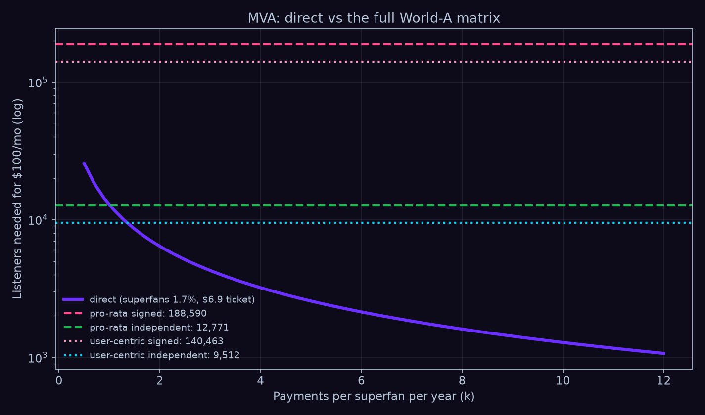

- **fig1_mva.png** — Minimum viable audience for $100/month per payout
  mechanism: signed pool 188,590 listeners, independent pool 12,771, direct
  3,204 at k=4 donations/superfan/yr — each further doubling of frequency
  halves the required audience.

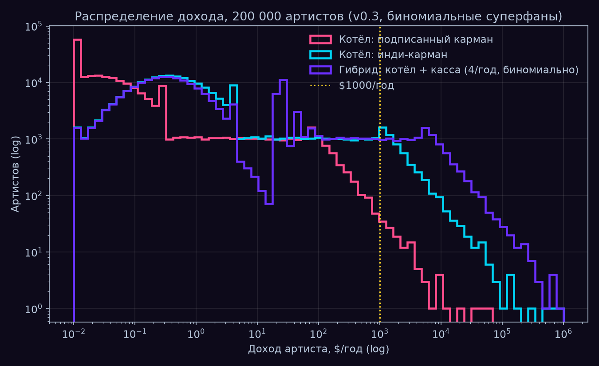

- **fig2_income_dist.png** — Annual income distribution over 200,000 synthetic
  artists (Gini 0.97 world, binomial superfan sampling): a 30-listener artist
  has an honest ~60% chance of zero direct income.

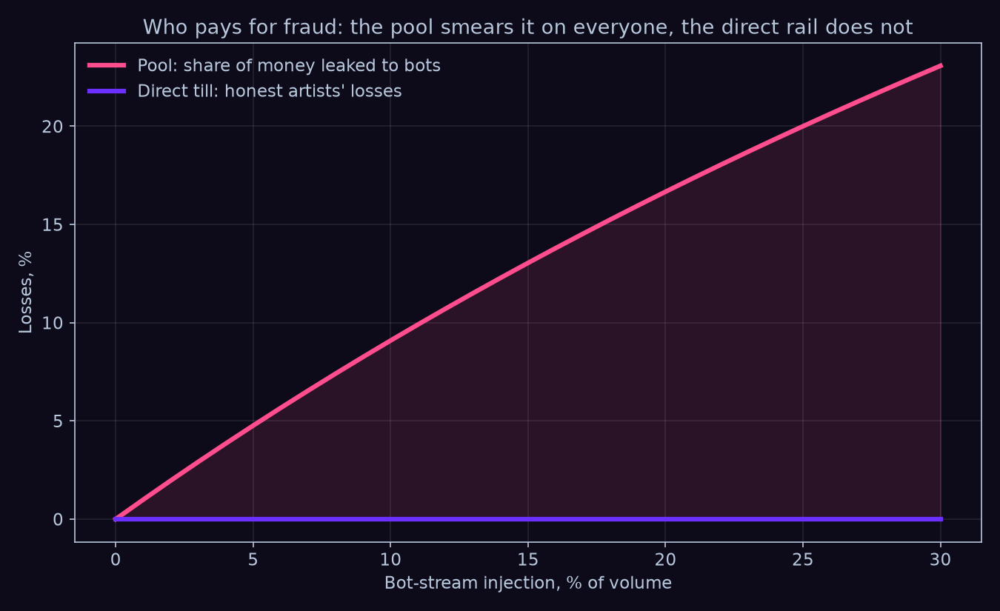

- **fig3_fraud.png** — Fraud dilution, analytic F/(1+F) curve: 30% bot-stream
  injection drains 23% of the pool from every artist; honest-artist losses on
  the direct rail are ~0.

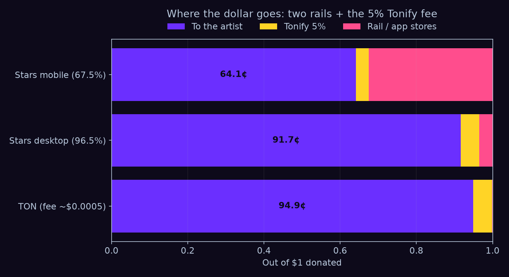

- **fig4_rails.png** — Where $1 goes: TON rail 94.9¢ to the artist / 5.0¢
  platform / 0.1¢ rail, against Stars desktop 91.7¢ and Stars mobile 64.1¢
  (32.5¢ to stores and spread).

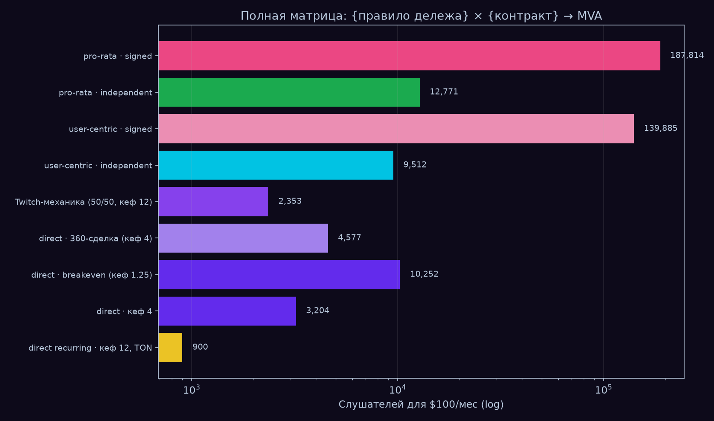

- **fig5_worlds_ladder.png** — The World A → World B ladder: changing the
  division rule moves MVA ~×1.3; changing the mechanism moves it 1–2 orders of
  magnitude (188,590 → 900 at recurring k=12).

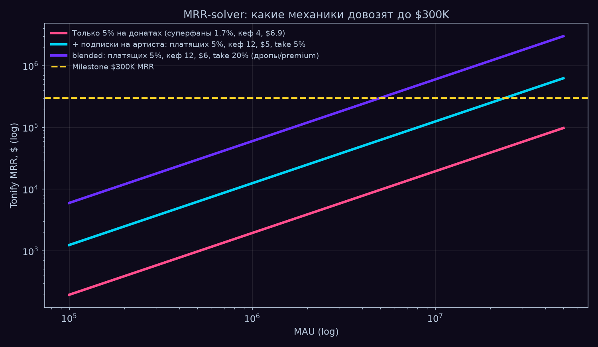

- **fig6_mrr_solver.png** — The $300K MRR solver: a lone 5% donation fee yields
  $1,955 MRR at 1M MAU (a 150× gap); the milestone closes only with recurring
  patronage and blended take 15–20% at 5–10M MAU.


- **fig7_matrix_heatmap.png** — The full {rule × contract} MVA matrix (hero
  figure): the rule moves viability ×1.34, the contract ×14.7; user-centric
  signed (140,095) is worse than pro-rata independent (12,771).

### sim2

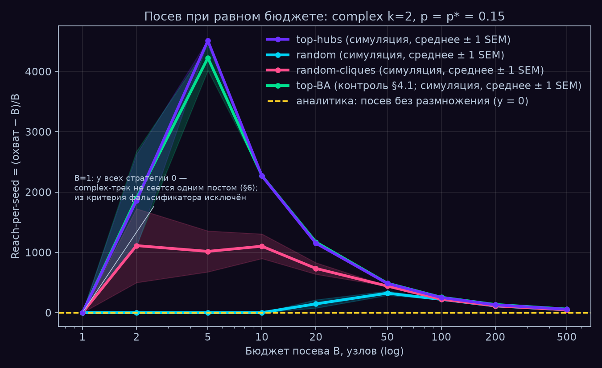

- **fig8_reach_per_seed.png** — sim2, equal-budget seeding on the synthetic
  graph: top-hub seeding beats random at every B ∈ [2; 500], peak efficiency at
  B=5 (4,509 organic adoptions per seeded node); pure-BA control confirms the
  verdict.

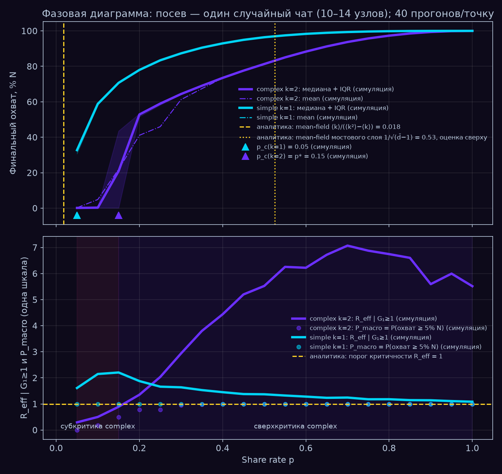

- **fig9_phase_diagram.png** — sim2 phase diagram: complex-contagion critical
  point p* = 0.15 (grid precision) against analytic references — simple
  mean-field 0.018 and chat-layer upper bound 0.53.


- **fig10_cascade.gif** — Cascade animation: one complex-contagion cascade
  spreading through chat cliques on a 4,000-node subgraph (48.3% reach), seeded
  from a single chat.

### sim3

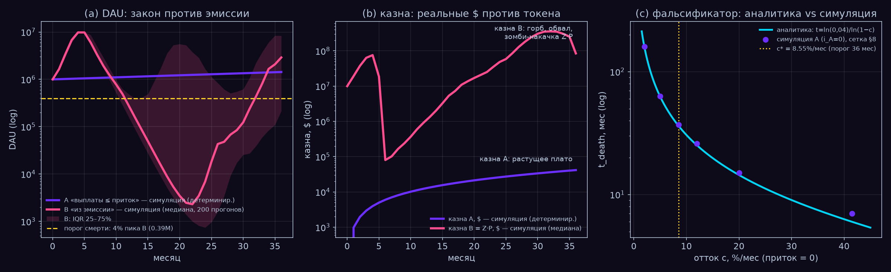

- **fig11_treasury_dau.png** — sim3, DAU and treasuries: the law-bound treasury
  plateaus at $41,700 with zero deaths while the emission treasury collapses
  ×943 from its $75.8M peak; falsifier panel — net churn ≥ 8.55%/month kills
  the law-bound product too.

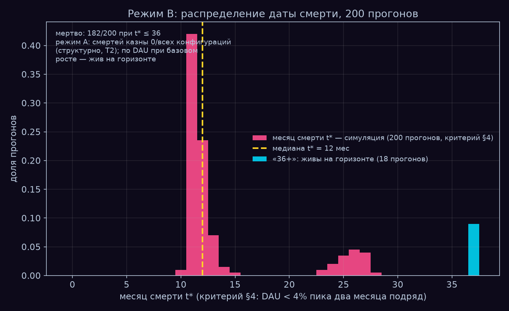

- **fig12_death_dist.png** — Distribution of the emission regime's death month
  over 200 runs (median t* = 12, IQR 11–13, baseline price form); the "36+"
  column is 18 zombie runs cycling at 4–7% of peak.

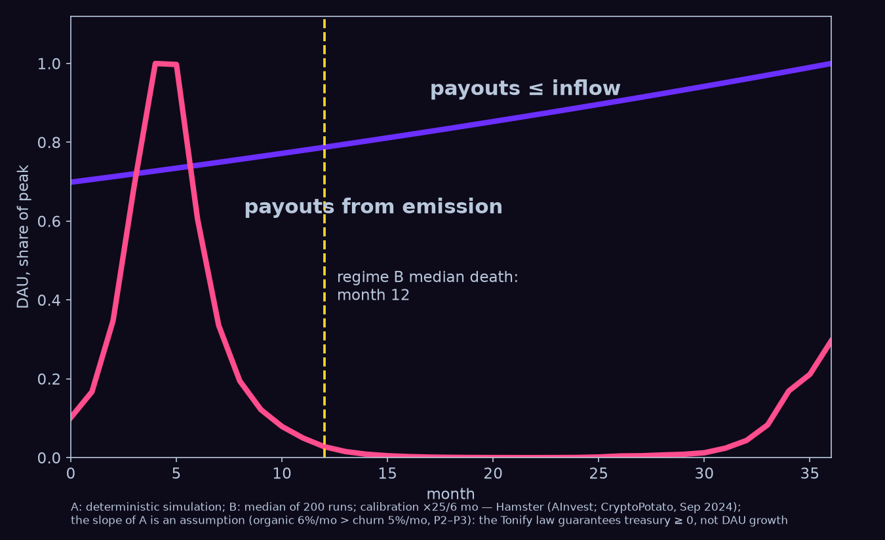

- **fig13_two_curves.png** — The two-curves slide: direct-economy treasury
  versus emission treasury on one axis, with the emission regime's median death
  month marked.

## Reproducibility

```
python3 run_all.py    # all three simulations + all 13 figures -> ./figures, ~1-2 min, exit 0
```

- **Deterministic:** seed=42 everywhere; a re-run produces byte-identical stdout
  and byte-identical figures.
- **Validation before conclusions:** every simulation prints its validation
  targets (target → obtained → PASS/FAIL) *before* its results; a FAIL blocks
  the conclusions.
- **Dependencies:** python3, numpy, matplotlib; scipy + networkx (sim2); pillow
  (gif). No API keys, no data downloads — the world is synthetic and
  self-contained.
- **Individually:** `python3 sim1/tonify_cash_sim.py` (then `sim1/v04_full.py`,
  `sim1/v05_matrix.py`), `python3 sim2/tonify_graph_sim.py` (~36 s),
  `python3 sim3/sim3_anti_graveyard.py` (~1 s).

## Repository layout

```
tonify-sim/
├── run_all.py      # one command: sim1 + sim2 + sim3, figures fig1-fig13
├── paper/          # sim1 documents: PAPER.md (model), RESULTS.md (numbers),
│                   #   CRITIC.md (red team, retractions)
├── sim1/           # cash register vs pool: tonify_cash_sim.py, v04_full.py,
│                   #   v05_matrix.py (the {rule x contract} matrix)
├── sim2/           # music spread on a synthetic Telegram-like graph:
│                   #   tonify_graph_sim.py, SPEC.md v1.3, README.md
├── sim3/           # anti-graveyard treasury law vs emission:
│                   #   sim3_anti_graveyard.py, SPEC.md v1.2, README.md
├── figures/        # fig1-fig13, regenerated by run_all.py
└── LICENSE         # MIT
```

The sim2/sim3 SPECs and the per-sim READMEs are process documentation in
Russian — spec revisions, red-team CHANGELOGs, validation protocols. This
README is self-contained: every headline number above appears here with its
source, and the figures carry the rest.

## Retracted & bounded

Each simulation went through a red team with the right to retract numbers.
This section is what that right produced. Genre and full text: sim1 —
[paper/CRITIC.md](paper/CRITIC.md); sim2/sim3 — CHANGELOG blocks in
[sim2/SPEC.md](sim2/SPEC.md) and [sim3/SPEC.md](sim3/SPEC.md).

**sim1 (CRITIC.md, verdict format: accusation → verdict → action).**
- *Retracted:* the "status quo = 0.42 donations/superfan/yr" headline — built on
  SoundCloud's 29% superfan revenue share, which is a share of *royalties* under
  fan-powered payouts, not of donations. A category error; the number was removed
  from the results (CRITIC §1). At that retracted frequency the direct economy
  honestly loses to the independent pool (MVA 30,782 vs 12,771).
- *Point → range:* breakeven became 0.38–1.25–6.31 donations/yr across 18
  combinations of three axes, each replaced after attack: plays/listener 21.2 →
  8–21 (LFM-1b measures panel lifetime, not a year; the error direction is
  *against* the direct economy), donation check $5 → $3.1–6.9 (the only
  music-specific PWYW experiment: mean €3.10 and a *rising* refusal share,
  24.4% vs 17.3%), superfan share 1.7% → 0.6–1.7% (the 90-9-1 rule measures as
  97-2-1) (CRITIC §2, §6, §7).
- *Fixed:* deterministic fractional superfans → binomial sampling — an artist
  with 30 listeners now has an honest ~60% chance of zero direct income
  (CRITIC §3). *Bounded:* Spotify's ">$1000/yr" is rightsholder royalties, so
  pool-vs-direct comparisons are valid only in the independent regime
  (artist = rightsholder) (CRITIC §5).

**sim2 (SPEC CHANGELOG v1.0 → v1.3).** Two honest construction stops, admitted
and resolved by spec revision, not by tuning to the result: v1.0's independent
clique placement blocked complex contagion entirely (p* did not exist — the
designed stop fired), and v1.1's T3(b) threshold was a metric/threshold category
error. v1.2's T3 thresholds were fixed *after* diagnostic runs — admitted as
post-hoc in the CHANGELOG, with the PASS reproduced on independent seed batches
(P_macro = 0.150/0.075/0.125, all under the 0.25 bar) and a standing process
rule added: thresholds are fixed before diagnostic runs, or the deviation is
declared. The v1.3 audit also quantified hub-definition contamination (81.6% of
top-500 union-hub degree is clique edges) and added a pure-BA control — which
showed the union definition had *understated* the channel advantage, not created
it. Audit verdict: accept; no numbers retracted.

**sim3 (SPEC CHANGELOG v1.1, v1.2).**
- *Target retracted as structurally unachievable:* the original T3a demanded
  200/200 strict deaths; the implementation proved a "phoenix" rebound is a
  property of the price equations (the buy/sell ratio in the zombie phase does
  not depend on price), so no calibration point yields 200/200. The target was
  reformulated with externally justified thresholds (80% loss = business-case
  death, more conservative than the Hamster −96% and GST −99% anchors);
  mechanics untouched (v1.1).
- *Unconditional numbers retracted to qualified:* "182/200 strict deaths, median
  t* = 12" now carries the mandatory qualifier *under the baseline price form* —
  red-team sensitivity: 148–190/200 across κ ∈ [0.35; 0.65], and 0/200 strict
  under a linear price form with moderate response, while the ≥80%-loss flagship
  stays 200/200 in every variant (v1.2). The claim "T1 *reproduces* Hamster
  ×25/6 mo" was weakened to "*consistent with*": the collapse-factor scale is
  semi-circular (the crash-rate clip derives from the same anchor); what is
  emergent is the peak timing and the endogenous path (v1.2).
- *Bounded:* everything after the first collapse breach is a phoenix artifact,
  not a forecast — the post-collapse phase is uncalibrated and diverges from
  both anchors (real projects sit on the floor; 96/200 model runs re-peak);
  sim3's conclusions are built on events up to and at the collapse (§11.11).

## Limitations, first-class

**This is a calibrated calculator, not data. It aims, the MVP measures.**

- **The decisive axes are unmeasured.** Donation frequency, check size and
  superfan share — the three axes of the breakeven range — are exactly the
  quantities no dataset provides for music; the simulations name the dials, the
  MVP is designed to measure them. Adjacent-industry cadence benchmarks (Twitch,
  Patreon, Tencent) substitute for them; the Tencent benchmark is blended with
  advertising, and gifting carries regulatory risk (−66% segment revenue for
  TME over 3 years) that the model does not price (PAPER §9).
- **sim1: the world is synthetic and the donation form is assumed.** The
  200,000-artist market is a piecewise construction between three measured
  anchors (validated: 87.0% / 2.6% / 44.5%, Gini 0.97), but the tail shape
  between anchors is a construction; the donation-check distribution
  (lognormal, Bandcamp/Twitch shape) is an assumption, not a music measurement;
  user-centric is a wallet-share approximation, not a full bipartite graph.
- **sim2 is a model, not Telegram data.** The graph is synthetic (BA + planted
  overlapping cliques); Telegram publishes no private-group statistics, so chat
  sizes, 50% coverage and bridge-layer density are assumptions or constructions
  — the chat-layer critical estimate transfers to reality only up to that
  density. No forgetting, no unsubscribes, no competing cascades: reach is an
  upper bound.
- **sim3's calibration is a composite.** One calibration anchor for the collapse
  shape (Hamster Kombat ×25/6 mo) plus two unverified stylized facts (STEPN
  entry economics, Axie); the emission regime reproduces a *class* of collapses,
  not any single project. The token price is a stylized form, not market
  microstructure — the strict death statistics (182/200, t* = 12) are a property
  of the baseline price form; only the ≥80%-loss result is form-invariant.
- **The simulations are deliberately isolated.** sim1 has no social dynamics,
  sim2 spreads one track in a vacuum with no churn, sim3 has no network effects
  between users and no competitors or external shocks; cross-sim coupling
  (does distribution reach convert to donations?) is out of scope.

## Related work

- **Attribution and provenance (the upper half of the pipe).** Teikari (2026),
  *Governing Generative Music: Attribution Limits, Platform Incentives, and the
  Future of Creator Income* (SSRN 6109087), with companion code
  [music-attribution-scaffold](https://github.com/petteriTeikari/music-attribution-scaffold),
  builds the attribution/provenance infrastructure — *who should be credited and
  under what confidence*. This repository is the lower half: *how the money
  physically moves once you know who to pay* — pool division versus direct
  payment mechanics, their fraud surfaces, and treasury survival.
- **Payout-rule theory.** Bergantiños & Moreno-Ternero (2023), *Revenue sharing
  at music streaming platforms* (arXiv:2310.11861), give the axiomatic
  foundations for pro-rata and user-centric division; their core theorem (any
  stable rule divides a listener's fee only among artists that listener
  streamed) is the reason World-A ceilings in sim1 are set by an artist's own
  audience under *any* formula (PAPER §1).
- **Independent convergence, three authors in three years** (a timestamp, not a
  claim of coordination): Burk (2023, [*Cheap Creativity and What It Will Do*, 57
  Georgia Law Review 1669](https://papers.ssrn.com/sol3/papers.cfm?abstract_id=4397423))
  argues cheap machine creativity shifts intellectual property toward regimes
  that *certify authenticity* rather than incentivize production → Teikari
  (2026) builds the attribution/provenance layer that does the certifying →
  this work (2026) models the payment mechanics that run on top once
  attribution is settled.

## Process

Each simulation went through an economist → engineer → red team → viz →
acceptance cycle, with the red team holding the right to retract numbers. The
project hit three honest construction stops (sim2 v1.0: p* did not exist by
construction; sim2 v1.1: the T3(b) metric/threshold category error; sim3: target
T3a structurally unachievable because of the phoenix rebound) — each resolved by
spec revision with a CHANGELOG and externally justified thresholds, none by
tuning to the result (verified by the red team on independent seed batches).
Retracted numbers are listed in [paper/CRITIC.md](paper/CRITIC.md) (sim1) and
the SPEC CHANGELOG blocks ([sim2/SPEC.md](sim2/SPEC.md),
[sim3/SPEC.md](sim3/SPEC.md)).

## License

MIT — see [LICENSE](LICENSE). To cite this repository, see
[CITATION.cff](CITATION.cff).
