*[🇬🇧 English](README.md) | 🇷🇺 Русский*

# tonify-sims: три симуляции прямой музыкальной экономики

Механизмы выплат, распространение по социальному графу и выживание казны для
прямой музыкальной экономики «слушатель → артист» на рельсах Telegram/TON —
детерминированно, через красную команду, воспроизводимо байт-в-байт.

**Сайт документации: [tonify-1.gitbook.io/tonify-docs](https://tonify-1.gitbook.io/tonify-docs/ru)** —
исследование в виде страниц, на русском и английском. Каждое число на сайте
извлекается из этого репозитория при сборке.

[](LICENSE)


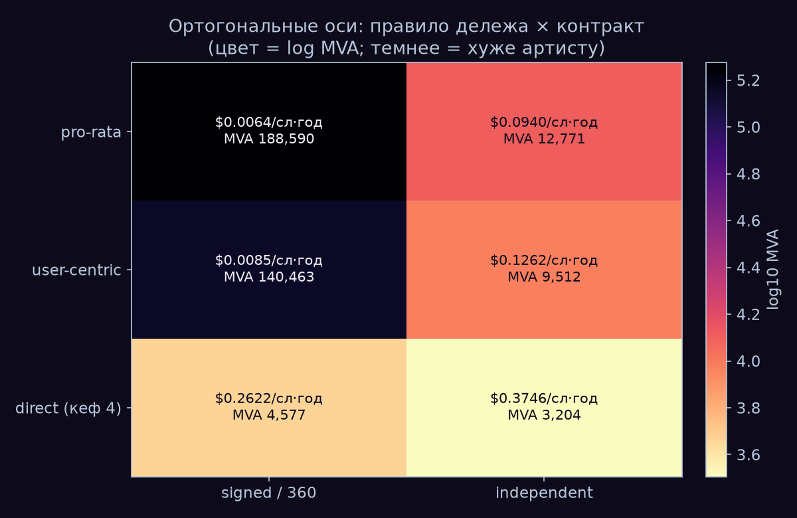

*Главная фигура: минимальная жизнеспособная аудитория (MVA) по полной матрице
{правило выплат × контракт} — аналитическая матрица, user-centric-строка из
Монте-Карло модели кошельков (200 000 слушателей, seed 42). Темнее = хуже для
артиста; в каждой ячейке — $/слушатель-год и аудитория, нужная для $100/мес.*

Вашему любимому артисту нужно 188 590 слушателей, чтобы зарабатывать $100 в
месяц на подписанном pro-rata стриминговом контракте, — или, на прямой рельсе
при кефе 4 доната в год, от 3 204 слушателей (лучший угол измеренных
диапазонов: средний чек $6,89, суперфаны 1,7%) до 20 161 (худший угол: чек
$3,10, суперфаны 0,6% — и он проигрывает инди-котлу с его 12 771; суть — в
полных диапазонах, не в краях). В этом репозитории — три
детерминированные симуляции прямой музыкальной экономики на рельсах
Telegram/TON (Tonify): sim1 оценивает механизмы выплат на синтетическом рынке
из 200 000 артистов, калиброванном на трёх независимо измеренных якорях; sim2
моделирует распространение музыки по синтетическому Telegram-подобному
социальному графу как complex contagion (модель, не данные Telegram); sim3
стресс-тестирует закон казны «выплаты никогда не превышают приток» против
токен-экономик на эмиссии. Индустрия десятилетие спорила о справедливой
формуле. Эффект формулы — даже не скаляр: он меняет знак на кроссовере
интенсивности слушателя u* (fig14); в базовой точке кошелька он ×1,34.
Контракт двигает жизнеспособность в ×14,8, и этот мультипликатор арифметичен,
а не эмерджентен: контрактная ось — один измеренный проход
(0,0003/0,00443 = 6,772%), применённый к обеим строкам; вклад матрицы —
соизмеримость, две оси на одной MVA-сетке (fig7;
[PAPER](paper/PAPER.ru.md), Addendum v0.5; [SPEC sim1](sim1/SPEC.md) §3). Каждое утверждение ниже несёт либо
источник, либо фальсификатор; каждую симуляцию рецензировала красная команда с
правом отзывать числа, и что она отозвала — задокументировано в этом README.
Происхождение каждого параметра — одна таблица: [SOURCES](SOURCES.ru.md).

## Глоссарий

Термины, на которые опираются фигуры и находки, — один раз:

| Термин | Значение |
|--------|----------|
| **MVA** | Минимальная жизнеспособная аудитория (minimum viable audience) — сколько слушателей нужно артисту для заданного дохода (здесь $100/мес) при заданном механизме выплат. Меньше = лучше для артиста. |
| **MRR** | Monthly recurring revenue — месячная регулярная выручка платформы. |
| **MAU / DAU** | Месячная / дневная активная аудитория (monthly / daily active users). |
| **ARPPU** | Average revenue per paying user — средняя выручка на платящего пользователя. |
| **кеф (rate k)** | Платежей на суперфана в год. k=4 — преданный фан платит четыре раза в год; месячная подписка — это k=12. |
| **take rate** | Доля платежа, которую оставляет себе платформа. |
| **pro-rata** | Дележ пула по глобальной доле стримов (дефолт Spotify): все подписочные деньги в одном котле, делятся по суммарным прослушиваниям. |
| **user-centric** | Дележ пула по кошельку каждого слушателя (SoundCloud FPR): деньги подписчика идут только артистам, которых этот подписчик слушал. |
| **правообладатель (rightsholder)** | Владелец прав на запись — артист, только если он независимый; иначе лейбл. Порог Spotify «>$1 000/год» считает правообладателей, а не артистов. |
| **подписанный / независимый (signed / independent)** | Контрактный статус: signed — между котлом и артистом стоит лейбл (~6,8% лейблового прохода); independent — артист сам правообладатель. |
| **PWYW** | Pay-what-you-want — цена «плати сколько хочешь». |
| **лог-шкала** | Ось, где каждый шаг умножает на 10 (10³ → 10⁴ → 10⁵). Используется, когда значения растянуты на порядки; равные визуальные шаги означают равные *отношения*, а не равные разности. |
| **lognormal** | Скошенное вправо распределение: большинство значений малы, длинный хвост больших. |
| **Gini** | Коэффициент неравенства: 0 — все равны, 1 — один забирает всё. Этот рынок валидируется на 0,97 по стримам артистов. |
| **IQR** | Межквартильный размах — средние 50% исходов (25–75-й перцентили). |
| **SEM** | Стандартная ошибка среднего — полоса ± на симулированном среднем. |
| **P_macro** | Вероятность, что посеянный каскад достигает ≥5% графа (макрокаскад). |
| **R_eff** | Эффективное число воспроизводства каскада: сколько принятий вызывает одно принятие. Выше 1,0 каскад растёт; продуктовый аналог — вирусный K-фактор. |
| **complex contagion (k=2)** | Принятие требует ≥2 разных принявших соседей (социальное доказательство) — против simple contagion (k=1), где конвертировать может одно касание. |
| **BA-граф** | Безмасштабная сеть Барабаши–Альберт — скелет синтетического Telegram-подобного графа с тяжёлым хвостом хабов. |

## sim1 — сколько стоит слушатель: цена механизмов выплат

Синтетический рынок из 200 000 артистов, калиброванный на трёх независимо
измеренных якорях (87% артистов ниже 1 000 стримов/год — Luminate; 2,6%
правообладателей выше $1 000/год — Spotify Loud & Clear; топ-0,28% держит ≈50%
стримов — CMA/Last.fm; получено: 87,0% / 2,6% / 44,5%, Gini 0,97). Полная
модель: [PAPER](paper/PAPER.ru.md); числа:
[RESULTS](paper/RESULTS.ru.md); отозванное:
[CRITIC](paper/CRITIC.ru.md); источник каждого параметра:
[SOURCES](SOURCES.ru.md).

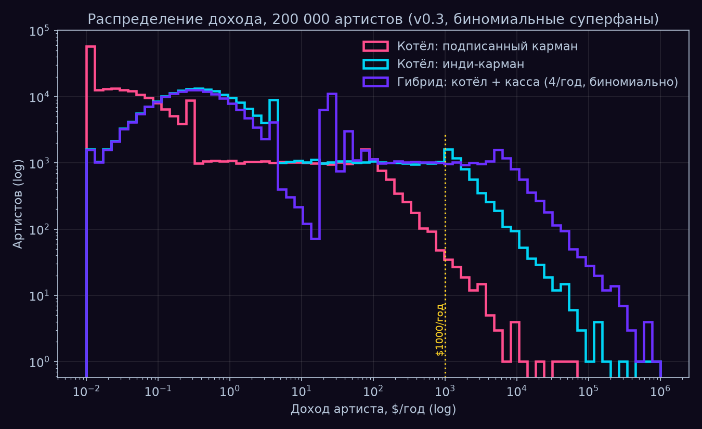

*fig2 — распределение годового дохода по 200 000 синтетических артистов
(симуляция, N=200 000 артистов, биномиальный сэмплинг суперфанов; лог-ось x:
каждый шаг вправо — доход ×10). Кривая подписанного котла лежит левее всех —
у артиста с 30 слушателями честные ~60% шанса нулевого прямого дохода.*

**Находка 1 — контракт весит больше правила, и у двух мультипликаторов разная
природа.** Контрактная ось матрицы {правило × контракт} — один эмпирический
скаляр: проход 0,0003/0,00443 = 6,772%, применённый к обеим строкам, — поэтому
её ×14,8 арифметичен по построению, а не эмерджентен; Монте-Карло-происхождение
есть только у оси правила (×1,34 в базовой точке кошелька). Вклад матрицы —
соизмеримость: две оси впервые сведены на одну MVA-сетку. Лучшая формула
World A по-прежнему не переживает лейбловый проход: user-centric signed
требует 140 463 слушателя против 12 771 у pro-rata independent. Лестница
$100/мес: 188 590 (pro-rata signed) → 12 771 (pro-rata independent) → 3 204
(касса при кефе 4, лучший угол); контракт signed-360 масштабирует долю артиста
в ×0,70 (MVA кассы 3 204 → 4 577). И сам эффект правила — не скаляр (fig14):
он зависит от интенсивности слушателя u и **меняет знак на u\* ≈ 14 146
плэев/год** (8 731 при PAID_SHARE 0,25; 21 371 при 0,60) — выше u\*
user-centric *хуже* pro-rata для аудитории данного артиста: правило
перекладывает деньги к артистам малослушающих и отбирает у артистов
многослушающих (при u=20k UC требует 18 341 против 12 771 у pro-rata).
Внешние эмпирики (SoundCloud: +34% в нижнюю корзину; Deezer: сдвиг 2,4% пула)
независимо подтверждают, что эффект правила мал против эффекта контракта —
качественный вывод выживает, точечная оценка нет
([PAPER](paper/PAPER.ru.md), Addendum v0.5; [SPEC sim1](sim1/SPEC.md) §3.1–3.2).

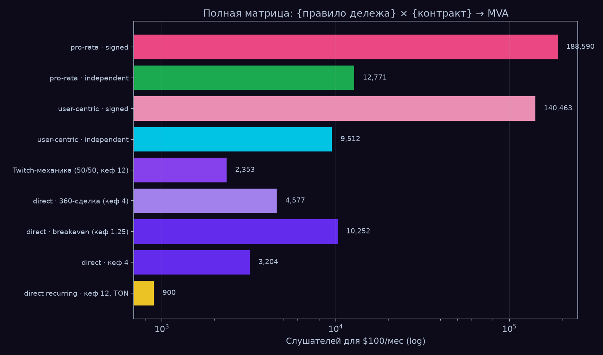

*fig5 — полная лестница World A → World B (аналитика; user-centric-строки из
Монте-Карло модели кошельков, 200 000 слушателей, seed 42). Ось x — лог MVA:
каждая линия сетки — в ×10 меньше нужных слушателей. Доля артиста по
ступеням: пуловые строки — сама per-stream-ставка; Twitch-механика — сплит
50%; direct · 360 — 0,80 × 0,70 = 0,56; direct breakeven/кеф 4 — 0,80; direct
recurring TON — 0,949. Смена правила дележа двигает MVA в ~×1,3; смена
механизма — на 1–2 порядка (188 590 → 900 при рекуррентном кефе 12 —
разложение: кеф 4→12 даёт ×3,0 до 1 068 при том же take 0,80, TON-рельса
0,80→0,949 даёт последние ×1,19 до 900).*

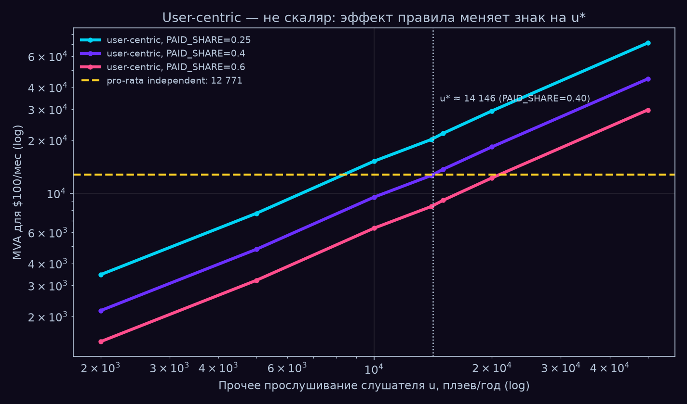

*fig14 — user-centric — не скаляр (Монте-Карло модель кошельков, 200 000
слушателей/точку, seed 42; лог-лог). MVA при user-centric как функция прочего
прослушивания слушателя u для трёх значений PAID_SHARE; жёлтый пунктир —
pro-rata independent (12 771). Каждая кривая пересекает его в своей точке
безразличия u\* (14 146 при базовом PAID_SHARE 0,40): выше u\* реформа правила
ухудшает положение аудитории этого артиста.*

**Находка 2 — breakeven — это диапазон, а не точка.** Прямые донаты бьют
инди-котёл стриминга, когда преданный фан платит чаще 0,38–1,25–6,31 раза/год
(min/медиана/max по 18 комбинациям осей; ранняя точечная оценка отозвана —
см. *Отозвано и ограничено*). Рекуррентный патронаж закрывает диапазон
структурно: кеф платящего фана Twitch/Patreon — 12/год против худшего угла
6,31, а рекуррентный кеф 12 на TON-рельсе роняет MVA кассы до 900. Ступень
Twitch-механики (2 353) считана на собственной фикс-цене подписки Twitch $5;
на том же среднем чеке $6,89, что и direct-строки, она дала бы 1 709 —
преимущество прямой экономики над Twitch-механикой в take rate (5% против
сплита 50%), а не в рельсе ([CRITIC](paper/CRITIC.ru.md) §1;
[RESULTS](paper/RESULTS.ru.md) v0.3 §1–§2; [PAPER](paper/PAPER.ru.md) §4;
[SPEC sim1](sim1/SPEC.md) §3.4).

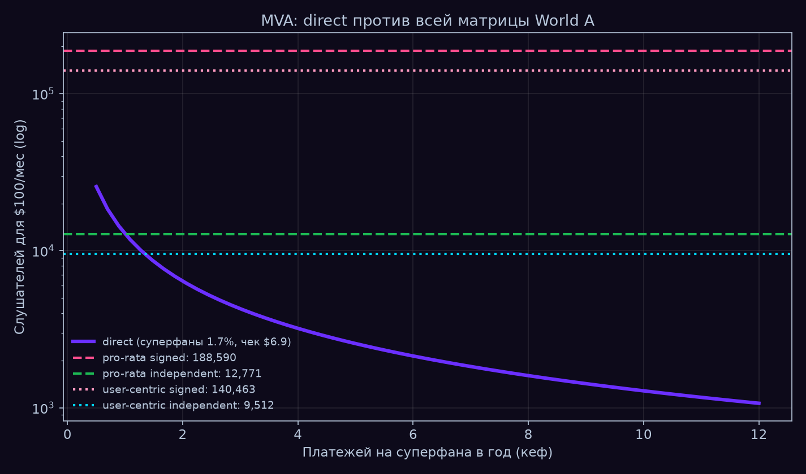

*fig1 — MVA против частоты платежа k (аналитические кривые; референсные
user-centric-линии несут Монте-Карло оценку кошельков). MVA = минимальная
жизнеспособная аудитория для $100/мес; k = платежей на суперфана в год; ось
y — лог. Фиолетовая кривая кассы, ныряющая под зелёную линию инди-котла около
k≈1, — это breakeven Находки 2; каждое дальнейшее удвоение k режет требуемую
аудиторию вдвое.*


*fig6 — solver $300K MRR (аналитические кривые; лог-лог оси). MRR = месячная
регулярная выручка платформы; MAU = месячная активная аудитория. Одинокая 5%
комиссия на донатах даёт $1 955 MRR на 1M MAU — разрыв 150× до milestone;
milestone сходится только с рекуррентным патронажем и blended take 15–20%
при 5–10M MAU.*

**Находка 3 — фрод разбавляет котлы, а не прямые рельсы.** Впрыск F% ботовых
стримов уводит F/(1+F) котла у каждого артиста — при 30% впрыска котёл теряет
23%, — тогда как потери честных артистов в кассе ≈ 0: бот не может донатить
чужими деньгами. Это аналитическая кривая разбавления при нулевой детекции,
не симуляция; у прямой экономики свои классы потерь (чарджбеки), но они не
размазываются на невиновных ([RESULTS](paper/RESULTS.ru.md), «Фрод»;
[PAPER](paper/PAPER.ru.md) §4; оговорка — [CRITIC](paper/CRITIC.ru.md) §4).

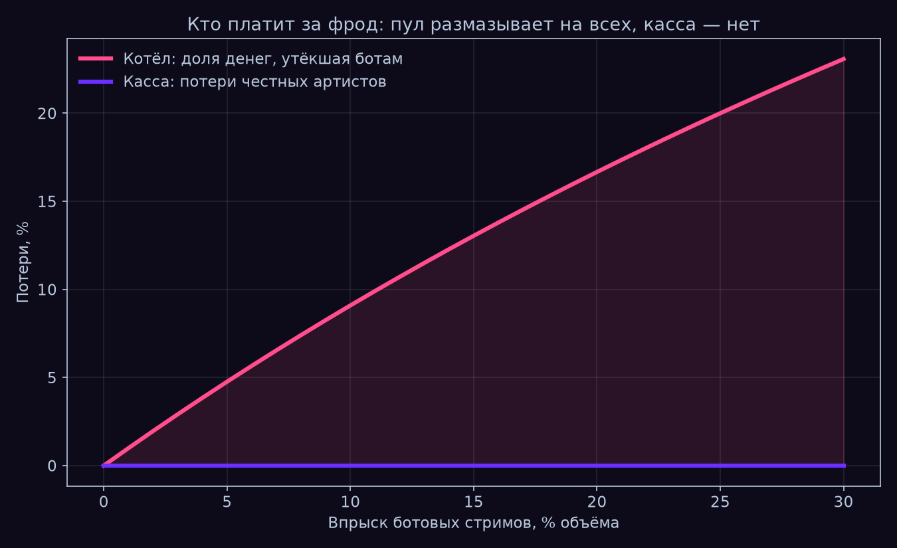

*fig3 — разбавление котла при впрыске ботовых стримов (аналитическая кривая
F/(1+F), без симуляции, детекция нулевая): потеря котла растёт к 23% при 30%
впрыска; кривая честных потерь прямой рельсы — плоский ноль.*

**Находка 4 — порог выплаты $13 для подписанных артистов — это десятилетие.**
При минимуме вывода Telegram $13 первой выплаты дольше года ждут 94,3%
артистов подписанного котла, дольше десяти лет — 89,9%; на прямой рельсе
средний донат $6,9 против того же порога $13. Из $1 на TON-рельсе до
артиста доходит 94,9¢ (5,0¢ платформе, 0,1¢ рельсе) против 64,1¢ на Stars
mobile ([RESULTS](paper/RESULTS.ru.md), «Логистика порога» + §3;
[PAPER](paper/PAPER.ru.md) §4).

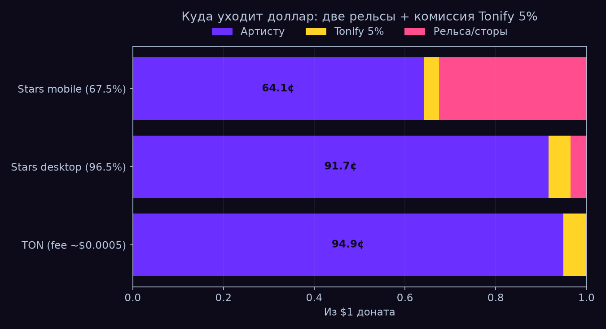

*fig4 — куда уходит $1 доната (арифметическая раскладка комиссий, без
симуляции): TON-рельса — 94,9¢ артисту / 5,0¢ платформе / 0,1¢ рельсе, против
Stars desktop 91,7¢ и Stars mobile 64,1¢ (32,5¢ — сторы и спред).*

## sim2 — как распространяется музыка: complex contagion на синтетическом Telegram-подобном графе

Граф Барабаши–Альберт на 50 000 узлов с 3 460 плантированными чат-кликами с
перекрытием (модель, не данные Telegram). Принятие — complex contagion: трек
конвертирует слушателя только после k=2 разных принявших соседей. Полный
протокол и валидация: [README sim2](sim2/README.md),
[SPEC sim2](sim2/SPEC.md).

**Находка 5 — посев в хабы бьёт случайный, на модели.** Посев в топ-хабы бьёт
случайный на каждом бюджете B ∈ [2; 500] при p = p* = 0,15 (B=5: 4 509 против
0 reach-per-seed; B=500: 55,4 против 46,5), и вердикт переживает контроль на
чистых BA-хабах (B=1 структурно вырожден для complex contagion и исключён).
Чаты меняют *надёжность* complex contagion, а не его возможность: P_macro =
1,00 / 0,15 / 1,00 (simple на голом BA / complex на голом BA / complex с
чатами) ([sim2/README](sim2/README.md); вердикт фальсификатора —
[SPEC](sim2/SPEC.md) §6; эксперимент C).

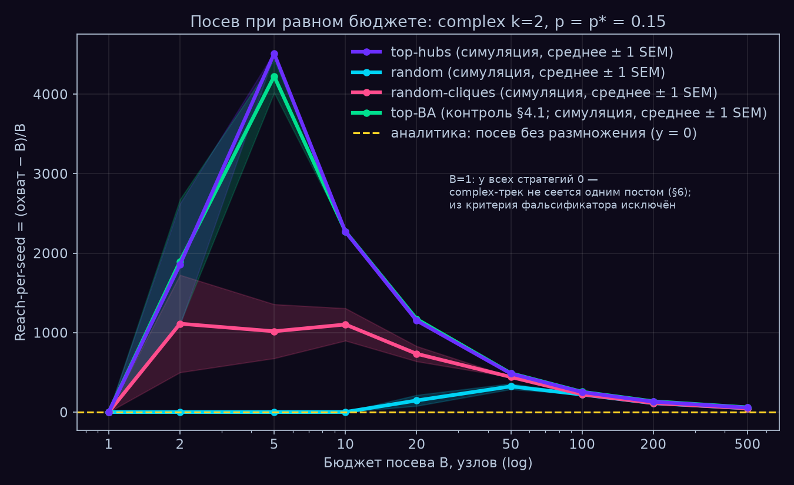

*fig8 — reach-per-seed по стратегиям посева (симуляция, 30 прогонов/точку,
среднее ± 1 SEM; лог-ось x бюджета посева B). Reach-per-seed =
(принявшие − B)/B, то есть органические принятия на посеянный узел; жёлтая
линия y=0 — «посев без умножения».*

**Находка 6 — преимущество хабов — эффект малого бюджета.** Разрыв
хабы-против-случайного — не постоянная премия: при B=5 это разница между
каскадом и его отсутствием (4 509 против 0 reach-per-seed — случайные сиды
просто не разжигают complex contagion), а при B=500 он сжимается до +19%
(55,4 против 46,5 — сходящиеся хвосты на fig8). Стратегия решает ровно тогда,
когда бюджет посева мал; при B ≤ 20 часть выигрыша хабов — плотность посева
как таковая, а чистый эффект хабов (+14–19%, до +27,7% у top-BA контроля)
изолируется при B ≥ 100 (эксперимент A; [sim2/README](sim2/README.md) §4.1
v1.3).

**Находка 7 — критическая точка модели — это K-фактор продукта.** R_eff —
принятий, вызванных одним принятием, — пересекает 1,0 между p = 0,15 и
p = 0,20 (0,891 → 1,354 при k=2): ниже этой конверсии на касание посеянный
трек затухает; выше — макрокаскады становятся почти неизбежными (P_macro
0,500 → 0,775). Ручка модели p («принятие соседа конвертирует меня») в
продуктовых терминах — вирусный K-фактор шэра, так что фазовая граница
p* = 0,15 — измеримая продуктовая мишень, а не абстракция симуляции: MVP,
поднявший конверсию на касание выше ~0,15–0,20, переносит продукт через
каскадный порог (эксперимент B; fig9).

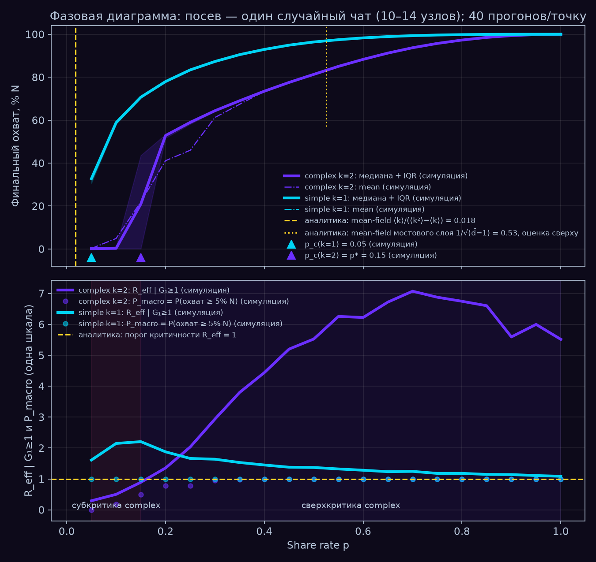

*fig9 — фазовая диаграмма (симуляция, 40 прогонов/точку) с аналитическими
референсами: критическая точка complex contagion p* = 0,15 (точность сетки)
против mean-field simple contagion 0,018 и верхней границы чат-слоя 0,53.
P_macro = вероятность достичь ≥5% графа; R_eff, пересекающий 1,0 между p=0,15
и p=0,20, — K-факторный порог Находки 7.*

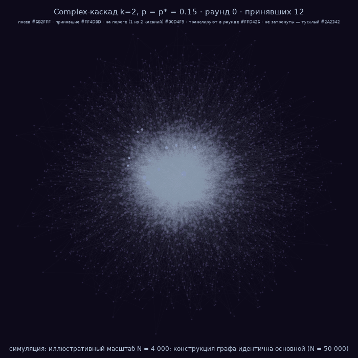

*fig10 — один каскад complex contagion, расходящийся по чат-кликам
(симуляция, одиночный каскад на иллюстративном подграфе из 4 000 узлов, охват
48,3%, посев из одного чата). Выше — полная анимация; прямая ссылка на файл:
[fig10_cascade.gif](figures/ru/fig10_cascade.gif) (2,6 МБ, 15 кадров,
раунд 0 → 14).*

## sim3 — выживание казны: закон «выплаты ≤ приток» против эмиссии

Режим A платит артистам только из реального притока (закон казны Tonify);
режим B платит из эмиссии токена (класс STEPN/Axie), калиброван на
консистентность с коллапсом Hamster Kombat ×25 за 6 месяцев. 200 Монте-Карло
прогонов; слой артистов из 10 000 агентов. Полная иерархия результатов и
фальсификаторы: [README sim3](sim3/README.md),
[SPEC sim3](sim3/SPEC.md).

**Находка 8 — эмиссионные экономики коллапсируют внутри модели; закон не
может обанкротить свою казну.** У казны под законом ноль нарушений инварианта
во всех прогонах (структурное свойство), тогда как эмиссионный режим теряет
≥80% пикового DAU в 200/200 Монте-Карло прогонов — инвариантно по всем
стресс-формам красной команды; более острая статистика держится только при
базовой форме цены: медианный месяц смерти t* = 12 [IQR 11–13], и казна в
токенной деноминации «умирает» на ~6 месяцев раньше продукта (дефект
деноминации — та же казна, размеченная в $ на момент сбора, растёт монотонно,
0/200 смертей). Отношение выплаты/приток эмиссионного режима пересекает 1,0
на 3-м месяце и пикует на 36,9 (он выплачивает в 37× больше, чем собирает)
против структурных 0,50 у режима под законом — что всё же не бессмертие:
чистый отток c − i ≥ 8,55%/мес убивает и продукт под законом, по внешним
причинам ([sim3/README](sim3/README.md) §7 v1.2; фальсификатор —
[SPEC](sim3/SPEC.md) §8; калибровка: Hamster Kombat ×25/6 мес).

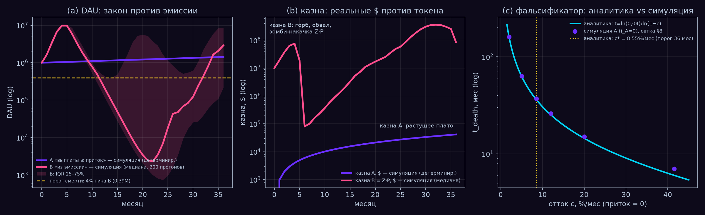

*fig11 — DAU и казны (симуляция: режим A детерминирован, режим B — медиана
200 прогонов; лог-оси y; IQR = полоса средних 50%): казна под законом выходит
на плато $41 700 с нулём смертей, пока эмиссионная казна обваливается в ×943
от пика $75,8M; правая панель — фальсификатор: чистый отток ≥ 8,55%/мес
убивает и продукт под законом (аналитическая кривая, точки симуляции).*

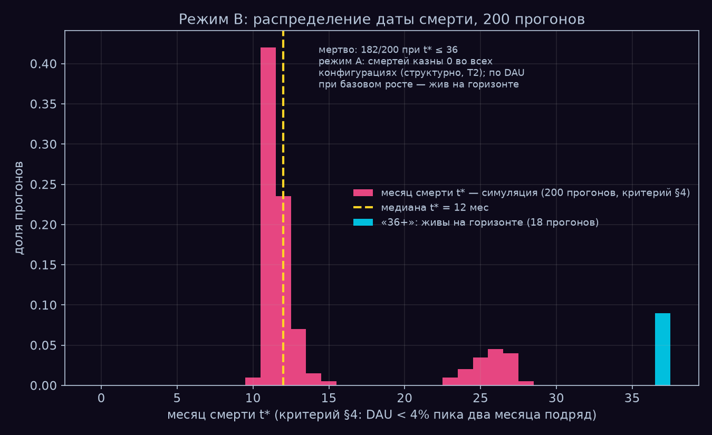

*fig12 — распределение месяца смерти эмиссионного режима (симуляция, 200
прогонов; медиана t* = 12, IQR 11–13, базовая форма цены); колонка «36+» —
это 18 зомби-прогонов, циклящих на 4–7% пика.*

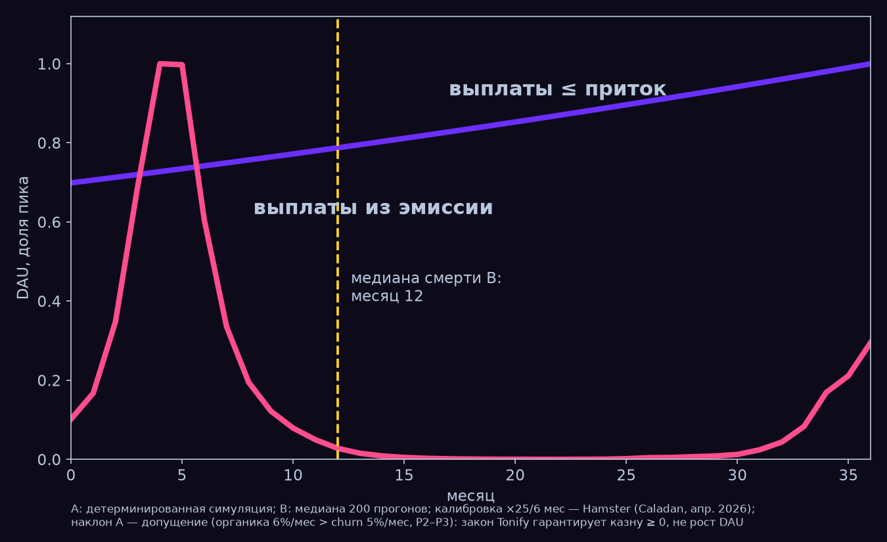

*fig13 — слайд двух кривых (симуляция: A детерминирован, B — медиана 200
прогонов; DAU как доля пика каждого режима): казна прямой экономики против
эмиссионной казны на одной оси, с отмеченным медианным месяцем смерти
эмиссионного режима.*

**Находка 9 — безразличие платформы: контракт артиста почти не двигает казну
платформы.** Переключение слоя артистов с independent на signed-360 режет
совокупный доход артистов на ~1/3 (режим A: $51 898 → $36 171/мес при
t=36) — но двигает казну платформы на −0,19% ($41 700 → $41 623). Платформа
финансово почти безразлична к контракту, на котором сидят её артисты: выручка
платформы масштабируется потоком, выживание артиста — его долей в потоке;
перо контракта держит сторона, у которой в этой игре меньше всего шкуры на
кону. Асимметрия стимулов структурна, а не моральна (слой артистов sim3, §6,
обе контрактные колонки).

**Находка 10 — отток артистов — норма в обоих режимах.** 9 010 из 10 000
артистов выходят за 36 месяцев даже в режиме A (выживают 990; медиана режима
B: 950 — причём артистские доходы режима B — бумажная эмиссия, а не внешние
деньги). Закон казны сохраняет живой *платформу*, но не *медианного
артиста* — индивидуальное выживание задаётся размером аудитории против порога
выхода, а это MVA-проблема sim1, не казначейская проблема sim3. Каталог
выживает через свой весовой коэффициент (w₃₆ = 0,989): платформа живёт на
длинном хвосте малых артистов, которые поодиночке отваливаются. Число, с
которого честно начинать, а не которое прятать (слой артистов sim3, §6).

## Воспроизводимость

```
python3 run_all.py    # три симуляции + 14 фигур × EN/RU -> ./figures + ./figures/ru, ~1-2 мин, exit 0
```

- **Детерминизм:** seed=42 везде; повторный запуск даёт байт-в-байт идентичный
  stdout между окружениями; фигуры байт-идентичны в пределах одного окружения
  (версия matplotlib и шрифты влияют на хэши PNG).
- **Валидация до выводов:** каждая симуляция печатает свои валидационные
  ворота (мишень → получено → допуск → PASS/FAIL) *до* результатов; FAIL
  блокирует выводы ненулевым exit (ворота sim1: [SPEC sim1](sim1/SPEC.md) §5).
- **Зависимости:** python3, numpy, matplotlib; scipy + networkx (sim2); pillow
  (gif). Ни API-ключей, ни скачивания данных — мир синтетический и
  самодостаточный.
- **По отдельности:** `python3 sim1/tonify_cash_sim.py` (затем
  `sim1/v04_full.py`, `sim1/v05_matrix.py`, `sim1/v06_uc_crossover.py`),
  `python3 sim2/tonify_graph_sim.py` (~36 с),
  `python3 sim3/sim3_anti_graveyard.py` (~1 с).
- **Происхождение:** каждый параметр модели → использованное значение →
  источник → vault-заметка в [SOURCES](SOURCES.ru.md).

## Структура репозитория

```
tonify-sims/
├── run_all.py        # одна команда: sim1 + sim2 + sim3, фигуры fig1-fig14
├── README.md         # EN, первичный · README.ru.md — этот файл, полный паритет
├── SOURCES.md        # каждый параметр -> значение -> источник -> vault-заметка (EN · SOURCES.ru.md)
├── paper/            # документы sim1, EN первичны + русские оригиналы:
│                     #   PAPER.md / PAPER.ru.md (модель; RU-оригинал — источник истины),
│                     #   RESULTS.md / RESULTS.ru.md (числа),
│                     #   CRITIC.md / CRITIC.ru.md (красная команда, отозванное)
├── sim1/             # касса против котла: SPEC.md v1.1 (уравнения модели,
│                     #   классы параметров, ворота), tonify_cash_sim.py,
│                     #   v04_full.py, v05_matrix.py, v06_uc_crossover.py
├── sim2/             # распространение музыки по синтетическому Telegram-подобному графу:
│                     #   tonify_graph_sim.py, SPEC.md v1.3, README.md
├── sim3/             # закон казны «анти-кладбище» против эмиссии:
│                     #   sim3_anti_graveyard.py, SPEC.md v1.2, README.md
├── figures/          # fig1-fig14 (EN) · figures/ru/ — те же 14 по-русски,
│                     #   оба набора перегенерирует run_all.py
└── LICENSE           # MIT
```

SPEC'и sim2/sim3 и пер-симуляционные README — процессная документация на
русском: ревизии спек, CHANGELOG'и красной команды, протоколы валидации. Этот
README самодостаточен: каждое заголовочное число выше приведено здесь со своим
источником, остальное несут фигуры.

## Отозвано и ограничено

Каждая симуляция прошла красную команду с правом отзывать числа. Эта секция —
то, что это право произвело. Жанр и полный текст: sim1 —
[CRITIC](paper/CRITIC.ru.md); sim2/sim3 — CHANGELOG-блоки в
[SPEC sim2](sim2/SPEC.md) и [SPEC sim3](sim3/SPEC.md).

**sim1 (CRITIC.ru.md, формат вердикта: обвинение → вердикт → действие).**
- *Отозвано:* заголовочное «статус-кво = 0,42 доната/суперфан/год» —
  построено на 29% суперфан-доли выручки SoundCloud, которая есть доля в
  *роялти* при fan-powered выплатах, а не в донатах. Категориальная ошибка;
  число удалено из результатов (CRITIC §1). При той отозванной частоте прямая
  экономика честно проигрывает инди-котлу (MVA 30 782 против 12 771).
- *Отозвано (v0.5.1):* MVA user-centric signed из Addendum, 140 095 —
  артефакт чернового прогона, не воспроизводимый кодом и внутренне
  несогласованный со своим сиблингом 188 590; заменён на 140 463, а лейбловый
  проход теперь *выводится* из двух якорей (0,0003/0,00443 = 6,772%) вместо
  ввода округлением 0,068 ([PAPER](paper/PAPER.ru.md), CHANGELOG v0.5.1).
- *Точка → диапазон:* breakeven стал 0,38–1,25–6,31 доната/год по 18
  комбинациям трёх осей, каждая из которых заменена после атаки:
  плэи/слушателя 21,2 → 8–21 (LFM-1b меряет время жизни панели, не год;
  направление ошибки — *против* прямой экономики), донат-чек $5 → $3,1–6,9
  (единственный music-specific PWYW-эксперимент: среднее €3,10 и *растущая*
  доля отказа, 24,4% против 17,3%), доля суперфанов 1,7% → 0,6–1,7% (правило
  90-9-1 при измерении оказывается 97-2-1) (CRITIC §2, §6, §7).
- *Починено:* детерминированные дробные суперфаны → биномиальный сэмплинг: у
  артиста с 30 слушателями теперь честные ~60% шанса нулевого прямого дохода
  (CRITIC §3). *Ограничено:* порог Spotify «>$1 000/год» — это роялти
  правообладателя, поэтому сравнения котла с кассой валидны только в
  инди-режиме (артист = правообладатель) (CRITIC §5).

**sim2 (SPEC CHANGELOG v1.0 → v1.3).** Два честных конструкционных стопа,
признанных и разрешённых ревизией спеки, а не подгонкой под результат:
независимая посадка клик v1.0 блокировала complex contagion полностью (p* не
существовал — сработал штатный стоп), а порог T3(б) v1.1 был категориальной
ошибкой метрика/порог. Пороги T3 в v1.2 были зафиксированы *после*
диагностических прогонов — это признано как post-hoc в CHANGELOG, PASS
воспроизведён на независимых батчах сидов (P_macro = 0,150/0,075/0,125, все
под планкой 0,25), и добавлено постоянное процессное правило: пороги
фиксируются до диагностических прогонов, либо отклонение декларируется. Аудит
v1.3 также квантифицировал загрязнение определения хабов (81,6% степени
union-хабов топ-500 — кликовые рёбра) и добавил чистый BA-контроль — который
показал, что union-определение *занижало* преимущество канала, а не создавало
его. Вердикт аудита: принять; отзываемых чисел нет.

**sim3 (SPEC CHANGELOG v1.1, v1.2).**
- *Мишень отозвана как структурно недостижимая:* исходный T3a требовал
  200/200 строгих смертей; реализация доказала, что «феникс»-отскок —
  свойство уравнений цены (отношение покупок/продаж в зомби-фазе не зависит
  от цены), так что ни одна точка калибровки не даёт 200/200. Мишень
  переформулирована с внешне обоснованными порогами (потеря 80% = смерть
  бизнес-кейса, консервативнее якорей Hamster −96% и GST −99%); механика не
  тронута (v1.1).
- *Безусловные числа отозваны до квалифицированных:* «182/200 строгих
  смертей, медиана t* = 12» теперь несёт обязательный квалификатор *при
  базовой форме цены* — сенситивность красной команды: 148–190/200 по
  κ ∈ [0,35; 0,65] и 0/200 строгих при линейной форме цены с умеренным
  откликом, тогда как флагманский результат потери ≥80% остаётся 200/200 в
  каждом варианте (v1.2). Утверждение «T1 *воспроизводит* Hamster ×25/6 мес»
  ослаблено до «*консистентен с*»: масштаб фактора коллапса полуциркулярен
  (клип темпа обвала выводится из того же якоря); эмерджентны тайминг пика и
  эндогенная траектория (v1.2).
- *Ограничено:* всё после первого пробития коллапса — феникс-артефакт, а не
  прогноз: пост-коллапсная фаза не калибрована и расходится с обоими якорями
  (реальные проекты лежат на дне; 96/200 модельных прогонов пикуют повторно);
  выводы sim3 построены на событиях до коллапса и в его момент (§11.11).

## Внешняя рецензия (v1.1)

Внешний рецензент сделал по sim1 семь выстрелов; легли все семь, один — жёстче,
чем написан. Жанр тот же, что в *Отозвано и ограничено*: что было заявлено,
каков вердикт, что изменилось ([SPEC sim1](sim1/SPEC.md), CHANGELOG v1.1):

- **«×14,8 — инверсия входа, матрица ранга 1».** Верно: контрактная ось — один
  измеренный проход, применённый к обеим строкам, поэтому ×14,8 = 1/0,06772
  по построению. Переформулировано везде: арифметика, не эмерджентность;
  вклад матрицы — соизмеримость.
- **«UC-скаляр скрывает зависимость от кошелька»** — и хуже, чем написано:
  эффект *меняет знак*. При u=20k user-centric требует 18 341 слушателя против
  12 771 у pro-rata. Скаляр ×1,34 заменён кроссовером u\* (fig14, v06):
  8 731 / 14 146 / 21 371 плэев/год при PAID_SHARE 0,25 / 0,40 / 0,60. Это
  превращает главную слабость sim1 в его единственную настоящую находку:
  у реформы правила есть точка безразличия, и по разные стороны от неё она
  работает в разные стороны.
- **«Геройский абзац ведёт с лучшего угла двух отозванных диапазонов».**
  Верно; hero теперь ведёт с полного диапазона углов 3 204…20 161 и называет,
  что худший угол проигрывает инди-котлу. В *Процесс* добавлено постоянное
  правило коммуникации.
- **«Twitch-бенчмарк на другом чеке».** Верно: 2 353 — на фикс-цене Twitch $5;
  на выровненном чеке $6,89 — 1 709; преимущество в take rate (5% против 50%),
  не в рельсе.
- **«3 204 → 900 молча смешивает частоту и рельс».** Верно; разложено: кеф
  4→12 даёт ×3,0 (до 1 068 при том же take), TON-рельса — ×1,19 (до 900);
  take по ступеням — в подписи fig5.
- **«У sim1 нет ворот; T3 промахивается на 11% без пометки».** Верно; создан
  sim1/SPEC.md (единственная симуляция без спеки — корень всех семи пунктов),
  ворота печатают мишень → получено → допуск → PASS/FAIL, FAIL завершает
  прогон ненулевым exit; допуск T3 [40%; 55%] задекларирован post-hoc с
  межисточниковым обоснованием (Celma 50% против CMA 63–65%).
- **«Побайтовость фигур переобещана».** Верно; ограничена одним окружением
  (stdout остаётся байт-идентичным между окружениями).

## Ограничения — первым классом

**Это калиброванный калькулятор, а не данные. Он целится — MVP меряет.**

- **Решающие оси не измерены.** Частота донатов, размер чека и доля
  суперфанов — три оси breakeven-диапазона — ровно те величины, которых ни
  один датасет для музыки не даёт; симуляции называют циферблаты, MVP
  спроектирован их мерять. Их подменяют кеф-бенчмарки смежных индустрий
  (Twitch, Patreon, Tencent); Tencent-бенчмарк — бленд с рекламой, а гифтинг
  несёт регуляторный риск (−66% выручки сегмента TME за 3 года), который в
  модель не входит ([PAPER](paper/PAPER.ru.md) §9).
- **sim1: мир синтетический, а форма донатов — допущение.** Рынок из 200 000
  артистов — кусочная конструкция между тремя измеренными якорями
  (валидировано: 87,0% / 2,6% / 44,5%, Gini 0,97), но форма хвоста между
  якорями — конструкция; распределение донат-чека (lognormal, форма
  Bandcamp/Twitch) — допущение, а не музыкальное измерение; user-centric —
  аппроксимация долей кошелька, а не полный двудольный граф.
- **sim2 — модель, а не данные Telegram.** Граф синтетический (BA +
  плантированные клики с перекрытием); Telegram не публикует статистику
  приватных групп, так что размеры чатов, покрытие 50% и плотность мостового
  слоя — допущения или конструкции; критическая оценка чат-слоя переносится
  на реальность только с точностью до этой плотности. Ни забывания, ни
  отписок, ни конкурирующих каскадов: охват — верхняя граница.
- **Калибровка sim3 — композит.** Один калибровочный якорь формы коллапса
  (Hamster Kombat ×25/6 мес) плюс два непроверенных стилизованных факта
  (входная экономика STEPN, Axie); эмиссионный режим воспроизводит *класс*
  коллапсов, а не какой-то один проект. Цена токена — стилизованная форма, а
  не рыночная микроструктура: строгая статистика смертей (182/200, t* = 12) —
  свойство базовой формы цены; форм-инвариантен только результат потери ≥80%.
- **Симуляции изолированы намеренно.** В sim1 нет социальной динамики, sim2
  распространяет один трек в вакууме без оттока, в sim3 нет сетевых эффектов
  между пользователями, конкурентов и внешних шоков; кросс-симуляционная
  связка (конвертируется ли охват дистрибуции в донаты?) вне скоупа.

## Смежные работы

- **Атрибуция и провенанс (верхняя половина трубы).** Teikari (2026),
  *Governing Generative Music: Attribution Limits, Platform Incentives, and the
  Future of Creator Income* (SSRN 6109087), с сопутствующим кодом
  [music-attribution-scaffold](https://github.com/petteriTeikari/music-attribution-scaffold),
  строит инфраструктуру атрибуции/провенанса — *кого кредитовать и с какой
  уверенностью*. Этот репозиторий — нижняя половина: *как деньги физически
  двигаются, когда уже известно, кому платить* — дележ котла против механики
  прямых платежей, их фрод-поверхности и выживание казны.
- **Теория правил выплат.** Bergantiños & Moreno-Ternero (2023), *Revenue
  sharing at music streaming platforms* (arXiv:2310.11861), дают
  аксиоматические основания дележа pro-rata и user-centric; их теорема ядра
  (любое устойчивое правило делит взнос слушателя только между артистами,
  которых этот слушатель слушал) — причина, по которой потолки World A в sim1
  заданы собственной аудиторией артиста при *любой* формуле
  ([PAPER](paper/PAPER.ru.md) §1).
- **Независимая конвергенция: три автора за три года** (таймстемп, а не
  заявка на координацию): Burk (2023, [*Cheap Creativity and What It Will Do*,
  57 Georgia Law Review 1669](https://papers.ssrn.com/sol3/papers.cfm?abstract_id=4397423))
  утверждает, что дешёвая машинная креативность сдвигает интеллектуальную
  собственность к режимам, которые *сертифицируют аутентичность*, а не
  стимулируют производство → Teikari (2026) строит слой
  атрибуции/провенанса, который эту сертификацию делает → эта работа (2026)
  моделирует платёжную механику, работающую поверх, когда атрибуция решена.

## Процесс

Каждая симуляция прошла цикл economist → engineer → красная команда → viz →
приёмка, с правом красной команды отзывать числа. Проект поймал три честных
конструкционных стопа (sim2 v1.0: p* не существовал по построению; sim2 v1.1:
категориальная ошибка метрика/порог в T3(б); sim3: мишень T3a структурно
недостижима из-за феникс-отскока) — каждый разрешён ревизией спеки с
CHANGELOG и внешне обоснованными порогами, ни один — подгонкой под результат
(проверено красной командой на независимых батчах сидов). Постоянное правило
коммуникации (внешняя рецензия v1.1): после отзыва точечной оценки в диапазон
заголовочный текст ведёт с середины или полного диапазона — никогда с края.
Отозванные числа перечислены в [CRITIC](paper/CRITIC.ru.md) (sim1) и
CHANGELOG-блоках спек ([SPEC sim1](sim1/SPEC.md), [SPEC sim2](sim2/SPEC.md),
[SPEC sim3](sim3/SPEC.md)).

## Лицензия

MIT — см. [LICENSE](LICENSE). Как цитировать репозиторий —
[CITATION.cff](CITATION.cff).
