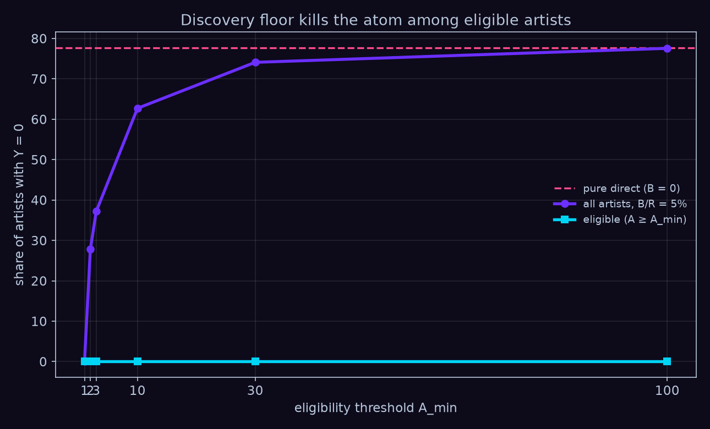
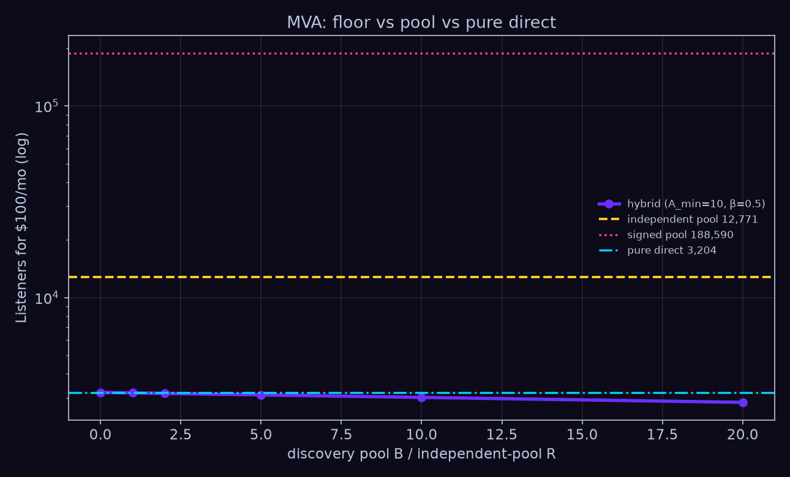

# SIM 6 — Direct + guaranteed discovery floor

Не четвёртый «чистый» механизм и не продаётся как direct. Прямые деньги от
фанатов остаются прямыми; фонд платформы $B$ страхует атом нуля у артистов с
подтверждённой аудиторией. Спека: [SPEC.md](SPEC.md).

```bash
python3 sim6/floor.py   # ворота печатаются ДО выводов, FAIL = exit 1
```

Мир — sim1 (N=200 000, seed=42, $A_i=\max(1,\lfloor s_i/\mathrm{PL}\rfloor)$).
Пустая аудитория (~7% в sim4) здесь не возникает: это свойство графа. sim6
атакует атом среди $A_i>0$.

$$
Y_i^{\mathrm{floor}}
=
D_i
+
B\,
\frac{\mathbf{1}\{A_i\ge A_{\min}\}\,A_i^\beta}
{\sum_j \mathbf{1}\{A_j\ge A_{\min}\}\,A_j^\beta},
\qquad 0<\beta<1.
$$

## Ворота (seed 42)

| Ворота | Что проверяют | Результат | Допуск | Вердикт |
|---|---|---|---|---|
| G0.1 | T1: доля s<1000 | 87.0% | 86–88% | **PASS** |
| G0.2 | T2: доля s>225 734 | 2.60% | 2.4–2.8% | **PASS** |
| G0.3 | T3: доля стримов топ-0.28% | 44.5% | 40–55% | **PASS** |
| G1 | q_eligible при B>0 | 0.000e+00 | = 0 | **PASS** |
| G2 | \|Σ floor − B\| / B | 0.000e+00 | ≤ 1e-9 | **PASS** |
| G3 | max \|Y − D − Bw\| | 1.098e-10 | ≤ 1e-8 | **PASS** |
| G4 | top-0.28% floor − top-0.28% D | −0.3307 | < 0 | **PASS** |
| G5 | MVA(B=0) − MVA direct | 0 | ±1 | **PASS** |

## Ключевые числа

База: среди артистов с $A_i>0$ (здесь все) чистый direct даёт **77.7%** нулей
($\sigma=0.017$, $k=4$).

**Атом — это eligibility, не размер фонда.** Любой $B>0$ даёт
$q_{\mathrm{eligible}}=0$. Общая доля нулей зависит от $A_{\min}$:

| A_min | eligible | q_all | q_eligible |
|---|---|---|---|
| 1 | 100.0% | **0.0%** | 0.0% |
| 2 | 71.6% | 27.9% | 0.0% |
| 3 | 62.0% | 37.2% | 0.0% |
| 10 | 34.1% | 62.7% | 0.0% |
| 30 | 19.1% | 74.1% | 0.0% |
| 100 | 11.6% | 77.6% | 0.0% |

Чтобы $q_{\mathrm{all}}\le 50\%$, достаточно $A_{\min}\le 3$. Пороги 25% и 10%
на этой сетке держатся только при $A_{\min}=1$ (при $A_{\min}=2$ остаётся 27.9%).
Размер $B$ атом не вяжет.

**B/R двигает величину пола, не атом.** Headline $A_{\min}=10$, $\beta=0.5$:

| B/R | q_all | q_eligible | MVA hybrid | Y < 0.01 μ_pool | top-0.28% Y |
|---|---|---|---|---|---|
| 0% | 77.7% | 43.9% | 3 204 | 77.7% | 44.5% |
| 1% | 62.7% | **0.0%** | 3 185 | 77.5% | 44.4% |
| 5% | 62.7% | **0.0%** | **3 110** | 62.7% | 44.1% |
| 20% | 62.7% | **0.0%** | 2 843 | 62.7% | 42.9% |

При $B=0.05R$ фонд = **$1 118 570**, eligible при $A_{\min}=10$: **68 271**,
средний пол среди eligible = **$16.38**/год. MVA сдвигается с 3 204 до 3 110 —
лотерею убрали, на жизнь не хватает. Пул independent 12 771, signed 188 590;
гибрид signed = independent, потому что $B$ и $D$ не проходят через $\rho$
(контрактная ось L2 на пол не садится).

**Хвост.** При $\beta=0.5$ верхние 0.28% забирают **11.4%** пола против **44.5%**
прямого дохода. При $\beta=1$ пол повторяет концентрацию $D$ (44.6%). Floor
меняет низ, не маскирует верх.

**Фрод.** $n$ фейковых аккаунтов с $A=A_{\min}$, доля $B$:

| A_min | n = 1 000 | n = 10 000 | n = 50 000 |
|---|---|---|---|
| 1 | 0.1% | 0.5% | 2.5% |
| 10 | 0.2% | 1.8% | 8.2% |
| 30 | 0.3% | 3.2% | **14.3%** |

$A_{\min}$ не является антифрод-защитой сам по себе: он переносит стимул с создания множества one-shot идентичностей на производство убедительных пороговых аудиторий.

Одноконтактный рой при $\beta=0.5$ крадёт мало: честный $\sum A^\beta$ тяжёлый.
Порог делает каждый фейк дороже (нужно $A_{\min}$ уникальных), но если ферма
дотягивает, её доля $B$ растёт — eligible-множество сжалось.

## Что с этим можно и нельзя заявлять

Не заявляем, что гибрид «лучше пула» по SSD: L4 сравнивает чистый direct с
пулом; пол снимает блок по определению среди eligible, но доминирование
зависит от $B$, $\beta$ и $A_{\min}$ — это уже другая теорема, здесь её нет.
Не заявляем, что $B$ бесплатен. Заявляемое: сколько стоит убрать lottery risk
у малых артистов, не превращая Tonify обратно в обычный streaming pool.
Ответ на этом мире: атом стоит eligibility; жизнь стоит $B$, и 5% инди-пула
дают $16/год$ eligible-артисту.



*fig21 — доля нулей против порога $A_{\min}$ при $B/R=5\%$, $\beta=0.5$. Eligible
всегда в нуле; общая доля нулей — кто не прошёл порог и проиграл лотерею $D$.*



*fig22 — MVA гибрида против $B/R$. Жёлтая — independent-пул 12 771; розовая —
signed 188 590; голубая — чистый direct 3 204. Пол едва двигает MVA: фонд
размазан.*
